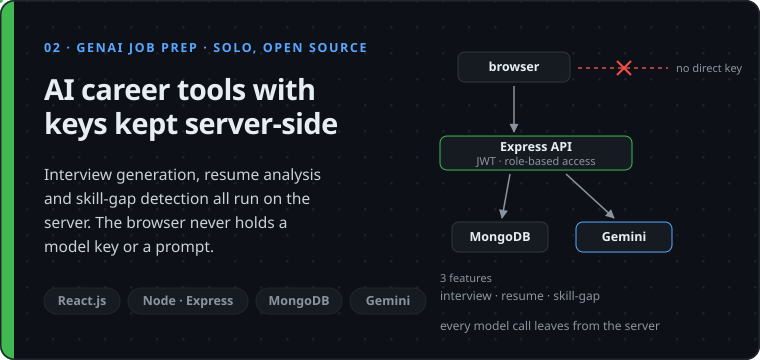
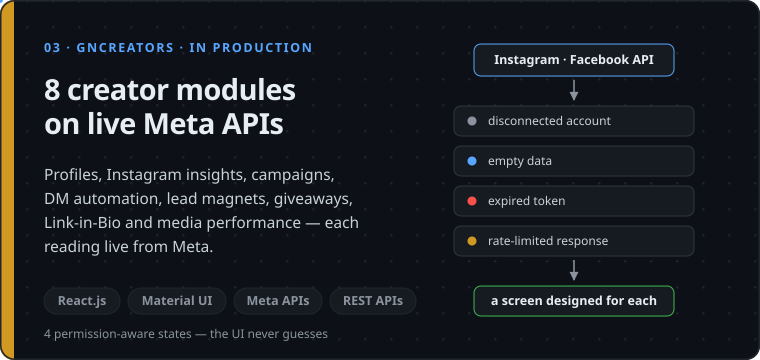

  <a href="#what-ive-built"><b>What I've built</b></a> ·
  <a href="#where-ive-worked"><b>Where I've worked</b></a> ·
  <a href="#public-code"><b>Public code</b></a> ·
  <a href="#stack"><b>Stack</b></a> ·
  <a href="#contact"><b>Contact</b></a>

When a marketing team clicks **Generate**, or a creator connects their Instagram, I build what
runs next: the interface, the REST calls behind it, the model requests that take four minutes,
and the screens that stay honest while they do.

> [!NOTE]
> Most of this runs in private company code, so it's shown here as diagrams and decisions.
> No proprietary code, data or client details.

## What I've built

Card 02 is public: <a href="https://github.com/Pooja24100/Gen-AI-Job-Preparation-App">Gen-AI-Job-Preparation-App →</a> · Cards 01 and 03 are company products, so the source isn't mine to publish.

<b>Two more products I shipped on the same team</b>

 

**GrooveNexus Studio — a 6-step music release workflow.** An artist sequences tracks by
dragging them into order, the release is checked against store-compliance rules before it can be
submitted, payment runs through Razorpay, and royalties report across **4 dimensions** — song,
store, country and month. The step order matters: a release that fails compliance never reaches
payment.

**GNTunes.com — a live consumer music platform.** Full-stack feature work across the responsive
user-facing interfaces and the REST API integration behind them.

Both are in production. Together with Blaze Tingg and GNCreators, that's the **4 production
products** I ship features across, and the fifth is the open-source platform in card 02.

## Where I've worked

| When | Where | What |
|---|---|---|
| **Sep 2025 – now** | **The Higher Pitch**, Noida Associate Software Engineer | Full-stack features across **4 production products**. Multi-step **OpenAI** and **Claude** workflows for **3 content types**, with review, editing, regeneration, progress tracking and async status handling. **4 security controls** wired in: JWT, Firebase OTP, role-based access control and OAuth. |
| Mar – Sep 2025 | The Higher Pitch, Noida Software Engineer Training | Built **20+ reusable React.js components** — forms, tables, modals, data cards, dashboards — cutting repeated work by about **15%**. Lifted app performance about **20%** with memoization, component optimization and refactoring, and standardized **4 interface states** across the codebase: loading, validation, empty, error. |
| Jun – Jul 2024 | Promotech Advertising, Jaipur Web Developer Intern | Delivered and debugged **10+ responsive pages** in HTML5, CSS3, Bootstrap and JavaScript, integrating REST APIs and closing cross-browser and mobile issues. |

B.Tech CSE, The Technological Institute of Textiles & Sciences (MDU Rohtak), 2021–25 ·
83.01% · React JS (Simplilearn) · Full Stack Java Development (Ducat) · Introduction to Java
& OOP (Udemy)

## Public code

Smaller than the products above, and honest about what's finished.

| Repo | What it does |
|---|---|
| **[GenAI Job Preparation App](https://github.com/Pooja24100/Gen-AI-Job-Preparation-App)** React · Node · Express · MongoDB · Gemini · JWT | Card 02, in full. Gemini runs server-side for interview generation, resume analysis and skill-gap detection, behind JWT auth and role-based access control. |
| **[Nova Voice Assistant](https://github.com/Pooja24100/nova-voice-assistant)** Python · Flask · SQLite | Browser-based voice assistant: speech recognition in, spoken AI replies out, with history kept locally between sessions. |
| **[Star Wars Character App](https://github.com/Pooja24100/Star-Wars-Character-App)** React · Vite · Tailwind | SWAPI client with pagination, search, filters and a detail modal — and every one of the 4 interface states handled, not just the happy path. |

## Stack

**Daily:** React.js · Next.js (App Router, SSR, ISR, SSG) · JavaScript (ES6+) · TypeScript ·
Redux · React Hooks · Context API · Node.js · Express.js · Python · REST API Design ·
MongoDB · OpenAI, Claude and Gemini APIs · Git · Postman 
**Also shipped with:** FastAPI · MySQL · Firebase · Core Java · SQL · Tailwind CSS ·
Material UI · Bootstrap · HTML5 · CSS3 · Docker · Nginx · HTTPS/SSL

**How I wire it up:** JWT authentication · role-based access control · OAuth (Google/Firebase) ·
MVC architecture · data modeling · prompt engineering · multi-step AI workflow orchestration ·
code review, testing and debugging

## Contact

I'm looking for **full-stack and AI-product roles** — teams where the interface, the API and the
model all have to hold up together. I'm in Noida and open to relocation or remote.

