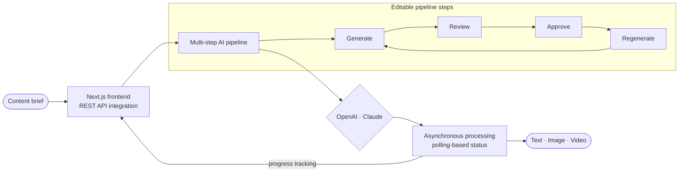

# Pooja Tanwar

### Software Engineer · Full-Stack Developer

**React.js · Next.js · Node.js · JavaScript · TypeScript · Python · Generative AI**

📍 Noida, India

  
  
  
  

---

## Professional Summary

Full-Stack Software Engineer with more than **1.5 years of experience** delivering **5 production products** across Generative AI, music technology, and the creator economy. Builds responsive applications, backend services, and REST APIs using React.js, Next.js, JavaScript, TypeScript, Node.js, Express.js, Python and MongoDB. Uses OpenAI, Claude, and Gemini to build secure multi-step AI workflows for text, image, and video generation. Improved application performance by **approximately 20%** and reduced repeated development effort by **approximately 15%**.

---

## Technical Skills

**Languages**

**Frontend**

Next.js App Router · SSR / ISR / SSG · React Hooks · Context API · Responsive Web Design

**Backend & APIs**

REST API Design · JWT Authentication · Role-Based Access Control · OAuth (Google / Firebase) · MVC Architecture

**Databases & AI**

Data Modeling · LLM Applications · Prompt Engineering · Multi-Step AI Workflows · AI Workflow Orchestration

**Cloud, DevOps & Engineering**

HTTPS/SSL · Code Review · Testing · Debugging

---

## Professional Experience

### Associate Software Engineer · The Higher Pitch
`Sep 2025 – Present` · Noida, India

- Delivered full-stack features across **4 production products** — Blaze Tingg, GNTunes.com, GrooveNexus Studio, and GNCreators — using React.js, Next.js, Redux, Node.js, Python, and REST APIs.
- Built multi-step Generative AI workflows with OpenAI and Claude for **3 content types** (text, image, and video), including review, editing, regeneration, progress tracking, and asynchronous status handling.
- Implemented **4 security controls** — JWT authentication, Firebase OTP, role-based access control, and OAuth — to connect frontend applications to backend services and REST APIs.
- Engineered GrooveNexus Studio's **6-step music release workflow**, including drag-to-order tracks, store-compliance validation, Razorpay payments, and royalty reporting across 4 dimensions: song, store, country, and month.
- Supported production releases through team ceremonies, code reviews, testing, debugging, deployment activities, and issue resolution across 4 products.

### Software Engineer Training · The Higher Pitch
`Mar 2025 – Sep 2025` · Noida, India · Frontend / Full-Stack Development

- Developed **20+ reusable React.js components** across forms, tables, modals, data cards, and dashboards, reducing repeated development effort by approximately **15%**.
- Improved application performance by approximately **20%** through memoization, component optimization, and refactoring; standardized loading, validation, empty, and error states.
- Connected React.js applications to REST APIs and standardized **4 interface states**: loading, validation, empty, and error.

### Web Developer Intern · Promotech Advertising
`Jun 2024 – Jul 2024` · Jaipur, India · Front-End Development

- Delivered **10+ responsive pages** using HTML5, CSS3, Bootstrap, and JavaScript, integrating REST APIs and resolving cross-browser and mobile compatibility issues.
- Debugged and optimized 10+ responsive pages to improve cross-browser compatibility, mobile usability, and frontend reliability.

---

## Selected Projects

### Blaze Tingg — AI Content & Marketing Automation Platform
`Production` · Next.js, Python, OpenAI, Claude, Material UI, REST APIs, Nginx

- Developed production AI workflows with OpenAI and Claude for 3 content types (text, image, and video), using editable multi-step pipelines with review, approval, regeneration, and asynchronous processing.
- Built campaign execution, creative asset, marketing calendar, and web data interfaces; contributed Python backend workflows and deployment behind Nginx with HTTPS/SSL.
- Connected frontend functionality to REST APIs and implemented polling-based status handling for long-running AI generation workflows.

### GenAI Job Preparation Platform — Full-Stack
`Solo · Open Source` · [View repository](https://github.com/Pooja24100/Gen-AI-Job-Preparation-App)
React.js, Node.js, Express.js, MongoDB, Gemini AI, JWT

- Developed a React.js frontend and Node.js/Express REST APIs with MongoDB, JWT authentication, and role-based access control; integrated Gemini AI on the server for 3 features: interview generation, resume analysis, and skill-gap detection.
- Protected AI API credentials and prompts through server-side integration and backend-controlled access.

### GNCreators — Creator Growth & Automation Platform
`Production` · React.js, JavaScript, Material UI, Meta APIs, REST APIs

- Built **8 responsive creator-growth modules** using React.js and Material UI: profiles, Instagram insights, campaigns, DM automation, lead magnets, giveaways, Link-in-Bio, and media performance.
- Connected Instagram, Facebook, and REST APIs with **4 permission-aware states**: disconnected account, empty data, expired token, and rate-limited response.

Other public repositories: <a href="https://github.com/Pooja24100/nova-voice-assistant">Nova Voice Assistant</a> · <a href="https://github.com/Pooja24100/Star-Wars-Character-App">Star Wars Character App</a>

---

## Education

**B.Tech in Computer Science & Engineering** · `2021 – 2025`
The Technological Institute of Textiles & Sciences (MDU Rohtak) · Aggregate **83.01%**

## Certifications

React JS *(Simplilearn)* · Full Stack Java Development *(Ducat)* · Introduction to Java & OOP *(Udemy)*

---

  

**Open to Software Engineer / Full-Stack Developer roles**

<a href="https://pooja-tanwar-fullstack-portfolio.netlify.app/">Portfolio</a> ·
<a href="https://linkedin.com/in/pooja-tanwar-00368a286">LinkedIn</a> ·
<a href="mailto:tanwarpooja2410@gmail.com">tanwarpooja2410@gmail.com</a>

