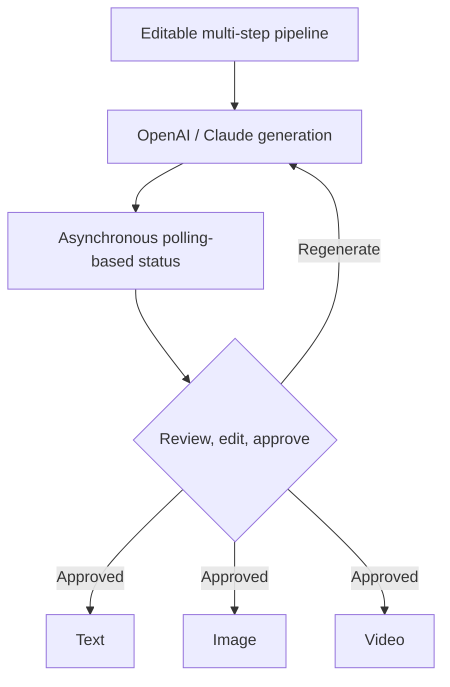

# Pooja Tanwar

  <b>SOFTWARE ENGINEER</b> &nbsp;·&nbsp; FULL-STACK DEVELOPER 
  REACT.JS &nbsp;·&nbsp; NEXT.JS &nbsp;·&nbsp; NODE.JS &nbsp;·&nbsp; GENERATIVE AI

  
  
  
  

  
  
  

[Profile](#01-profile) &nbsp;·&nbsp; [Toolkit](#02-toolkit) &nbsp;·&nbsp; [Selected work](#03-selected-work) &nbsp;·&nbsp; [Experience](#04-experience) &nbsp;·&nbsp; [Education](#05-education-and-certifications)

## `01` Profile

> More than **1.5 years** of experience and **5 production products** delivered across Generative AI, music technology and the creator economy.

Responsive applications, backend services and REST APIs built with React.js, Next.js, JavaScript, TypeScript, Node.js, Express.js, Python and MongoDB. OpenAI, Claude and Gemini wired into secure, multi-step AI workflows for text, image and video generation — with application performance improved by roughly **20%** and repeated development effort reduced by roughly **15%**.

`Problem solving` &nbsp;`Clear communication` &nbsp;`Teamwork`

## `02` Toolkit

**Languages** — `JavaScript (ES6+)` `TypeScript` `Python` `SQL` `Core Java`

**Frontend** — `React.js` `Next.js (App Router, SSR, ISR, SSG)` `Redux` `React Hooks` `Context API` `HTML5` `CSS3` `Tailwind CSS` `Material UI` `Bootstrap` `Responsive Web Design`

**Backend & APIs** — `Node.js` `Express.js` `Python` `FastAPI` `REST API Design` `JWT Authentication` `Role-Based Access Control` `OAuth (Google/Firebase)` `MVC Architecture`

**Databases & AI** — `MongoDB` `MySQL` `Firebase` `Data Modeling` `OpenAI API` `Claude API` `Gemini AI` `LLM Applications` `Prompt Engineering` `Multi-Step AI Workflows` `AI Workflow Orchestration`

**Cloud, DevOps & Engineering** — `Nginx` `Docker` `HTTPS/SSL` `Git` `GitHub` `Postman` `Code Review` `Testing` `Debugging`

## `03` Selected work

### Blaze Tingg · AI Content and Marketing Automation Platform

 &nbsp;`Next.js` `Python` `OpenAI` `Claude` `Material UI` `REST APIs` `Nginx`

- Developed production AI workflows with OpenAI and Claude for **3 content types** — text, image and video — using editable multi-step pipelines with review, approval, regeneration and asynchronous processing.
- Built campaign execution, creative asset, marketing calendar and web data interfaces; contributed Python backend workflows and deployment behind Nginx with HTTPS/SSL.
- Connected frontend functionality to REST APIs and implemented polling-based status handling for long-running AI generation workflows.

### [GenAI Job Preparation Platform](https://github.com/Pooja24100/Gen-AI-Job-Preparation-App) · Full-Stack

 &nbsp;`React.js` `Node.js` `Express.js` `MongoDB` `Gemini AI` `JWT`

- Developed a React.js frontend and Node.js/Express REST APIs with MongoDB, JWT authentication and role-based access control; integrated Gemini AI on the server for **3 features**: interview generation, resume analysis and skill-gap detection.
- Protected AI API credentials and prompts through server-side integration and backend-controlled access.

### GNCreators · Creator Growth and Automation Platform

 &nbsp;`React.js` `JavaScript` `Material UI` `Meta APIs` `REST APIs`

- Built **8 responsive creator-growth modules** using React.js and Material UI: profiles, Instagram insights, campaigns, DM automation, lead magnets, giveaways, Link-in-Bio and media performance.
- Connected Instagram, Facebook and REST APIs with **4 permission-aware states**: disconnected account, empty data, expired token and rate-limited response.

More in the open: [Nova Voice Assistant](https://github.com/Pooja24100/nova-voice-assistant) · [Star Wars Character App](https://github.com/Pooja24100/Star-Wars-Character-App) · [all repositories](https://github.com/Pooja24100?tab=repositories)

## `04` Experience

### Associate Software Engineer — The Higher Pitch

`Sep 2025 — Present` · Noida, India

- Delivered full-stack features across **4 production products** — Blaze Tingg, GNTunes.com, GrooveNexus Studio and GNCreators — using React.js, Next.js, Redux, Node.js, Python and REST APIs.
- Built multi-step Generative AI workflows with OpenAI and Claude for **3 content types** (text, image, video), including review, editing, regeneration, progress tracking and asynchronous status handling.
- Implemented **4 security controls**: JWT authentication, Firebase OTP, role-based access control and OAuth.
- Engineered the GrooveNexus Studio **6-step music release workflow**: drag-to-order tracks, store-compliance validation, Razorpay payments and royalty reporting across **4 dimensions** (song, store, country, month).
- Supported production releases through team ceremonies, code reviews, testing, debugging, deployment activities and issue resolution across **4 products**.

### Software Engineer Training — The Higher Pitch

`Mar 2025 — Sep 2025` · Noida, India · Frontend / Full-Stack Development

- Developed **20+ reusable React.js components** across forms, tables, modals, data cards and dashboards, reducing repeated development effort by approximately **15%**.
- Improved application performance by approximately **20%** through memoization, component optimization and refactoring; standardized loading, validation, empty and error states.
- Connected React.js applications to REST APIs and standardized **4 interface states**.

### Web Developer Intern — Promotech Advertising

`Jun 2024 — Jul 2024` · Jaipur, India · Front-End Development

- Delivered **10+ responsive pages** using HTML5, CSS3, Bootstrap and JavaScript, integrating REST APIs and resolving cross-browser and mobile compatibility issues.
- Debugged and optimized **10+ responsive pages** to improve cross-browser compatibility, mobile usability and frontend reliability.

## `05` Education and certifications

**B.Tech, Computer Science and Engineering** — The Technological Institute of Textiles and Sciences (MDU Rohtak)

`2021 — 2025` · Aggregate **83.01%**

**Certifications** — `React JS — Simplilearn` `Full Stack Java Development — Ducat` `Introduction to Java and OOP — Udemy`

---

<a href="https://pooja-tanwar-fullstack-portfolio.netlify.app/">Portfolio</a> &nbsp;·&nbsp; <a href="https://linkedin.com/in/pooja-tanwar-00368a286">LinkedIn</a> &nbsp;·&nbsp; <a href="https://github.com/Pooja24100">GitHub</a> &nbsp;·&nbsp; <a href="mailto:tanwarpooja2410@gmail.com">tanwarpooja2410@gmail.com</a>

