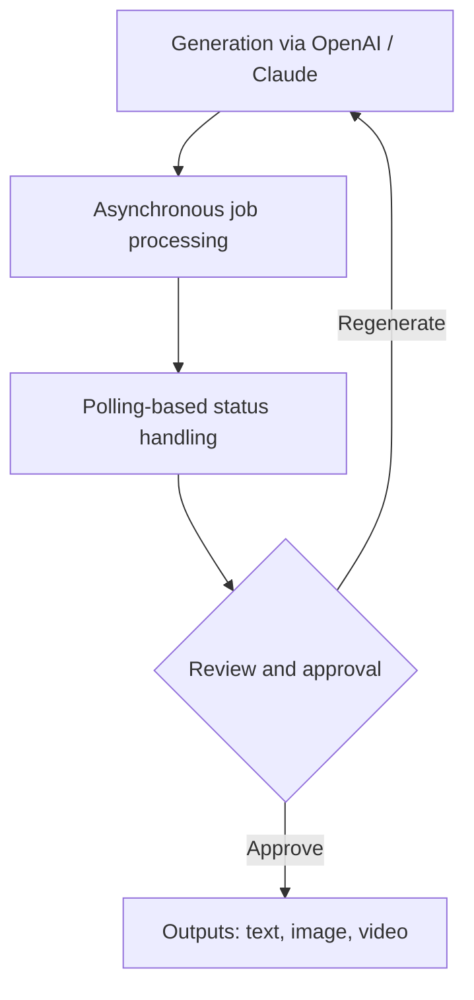

<picture>
  <source media="(prefers-color-scheme: dark)" srcset="assests/hero-dark.svg" />
  <source media="(prefers-color-scheme: light)" srcset="assests/hero-light.svg" />
  
</picture>

  
  
  
  

## About Me

Full-Stack Software Engineer with more than **1.5 years of experience** and **5 production products** delivered across Generative AI, music technology and the creator economy.

I build responsive applications, backend services and REST APIs with React.js, Next.js, JavaScript, TypeScript, Node.js, Express.js, Python and MongoDB, and I use OpenAI, Claude and Gemini to compose secure multi-step AI workflows for text, image and video generation.

Recent work improved application performance by approximately **20%** and reduced repeated development effort by approximately **15%**.

Alongside the engineering work I bring problem solving, clear communication and teamwork.

## Tech Stack

  <picture>
    <source media="(prefers-color-scheme: dark)" srcset="https://skillicons.dev/icons?i=js,ts,python,java,react,nextjs,redux,tailwind,materialui,bootstrap,nodejs,express,fastapi,mongodb,mysql,firebase,docker,nginx,git,postman&amp;perline=10&amp;theme=dark" />
    <source media="(prefers-color-scheme: light)" srcset="https://skillicons.dev/icons?i=js,ts,python,java,react,nextjs,redux,tailwind,materialui,bootstrap,nodejs,express,fastapi,mongodb,mysql,firebase,docker,nginx,git,postman&amp;perline=10&amp;theme=light" />
    
  </picture>

- **Frontend** — React.js · Next.js (App Router / SSR / ISR / SSG) · Redux · React Hooks · Context API · HTML5 · CSS3 · Tailwind CSS · Material UI · Bootstrap · Responsive Web Design
- **Backend** — Node.js · Express.js · Python · FastAPI · MVC Architecture
- **APIs and Authentication** — REST API Design · JWT Authentication · Role-Based Access Control · OAuth (Google / Firebase)
- **Databases** — MongoDB · MySQL · Firebase · Data Modeling
- **AI and Generative AI** — OpenAI API · Claude API · Gemini AI · LLM Applications · Prompt Engineering · Multi-Step AI Workflows · AI Workflow Orchestration
- **Languages** — JavaScript (ES6+) · TypeScript · Python · SQL · Core Java
- **DevOps and Cloud** — Nginx · Docker · HTTPS / SSL
- **Tools and Collaboration** — Git · GitHub · Postman · Code Review · Testing · Debugging

## Professional Experience

### Associate Software Engineer · The Higher Pitch

*Sep 2025 – Present · Noida, India · React.js, Next.js, Redux, Node.js, Python, REST APIs*

- Delivered full-stack features across **4 production products**: Blaze Tingg, GNTunes.com, GrooveNexus Studio and GNCreators.
- Built multi-step Generative AI workflows with OpenAI and Claude for **3 content types** (text, image, video), covering review, editing, regeneration, progress tracking and asynchronous status handling.
- Implemented **4 security controls**: JWT authentication, Firebase OTP, role-based access control and OAuth.
- Engineered the GrooveNexus Studio **6-step music release workflow**: drag-to-order tracks, store-compliance validation, Razorpay payments and royalty reporting across 4 dimensions (song, store, country, month).
- Supported production releases through team ceremonies, code reviews, testing, debugging, deployment activities and issue resolution across 4 products.

---

### Software Engineer Training · The Higher Pitch

*Mar 2025 – Sep 2025 · Noida, India · Frontend and Full-Stack Development · React.js, REST APIs*

- Developed **20+ reusable React.js components** across forms, tables, modals, data cards and dashboards, reducing repeated development effort by approximately 15%.
- Improved application performance by approximately **20%** through memoization, component optimization and refactoring, and standardized loading, validation, empty and error states.
- Connected React.js applications to REST APIs and standardized **4 interface states**.

---

### Web Developer Intern · Promotech Advertising

*Jun 2024 – Jul 2024 · Jaipur, India · Front-End Development · HTML5, CSS3, Bootstrap, JavaScript, REST APIs*

- Delivered **10+ responsive pages**, integrating REST APIs and resolving cross-browser and mobile compatibility issues.
- Debugged and optimized 10+ responsive pages to improve cross-browser compatibility, mobile usability and frontend reliability.

## Featured Projects

### Blaze Tingg — AI Content and Marketing Automation Platform

*Production · Source not public · Next.js, Python, OpenAI, Claude, Material UI, REST APIs, Nginx*

- Production AI workflows with OpenAI and Claude for **3 content types** (text, image, video), built as editable multi-step pipelines with review, approval, regeneration and asynchronous processing.
- Campaign execution, creative asset, marketing calendar and web data interfaces, with Python backend workflows deployed behind Nginx with HTTPS/SSL.

**Key contribution** — polling-based status handling for long-running AI generation workflows.

---

### GenAI Job Preparation Platform — Full-Stack

*Solo project, open source · React.js, Node.js, Express.js, MongoDB, Gemini AI, JWT*

- React.js frontend with Node.js and Express REST APIs on MongoDB, secured by JWT authentication and role-based access control.
- Gemini AI integrated on the server for **3 features**: interview generation, resume analysis and skill-gap detection.

**Key contribution** — protected AI API credentials and prompts through server-side integration and backend-controlled access.

[View repository](https://github.com/Pooja24100/Gen-AI-Job-Preparation-App)

---

### GNCreators — Creator Growth and Automation Platform

*Production · Source not public · React.js, JavaScript, Material UI, Meta APIs, REST APIs*

- Built **8 responsive creator-growth modules**: profiles, Instagram insights, campaigns, DM automation, lead magnets, giveaways, Link-in-Bio and media performance.

**Key contribution** — connected Instagram, Facebook and REST APIs with 4 permission-aware states: disconnected account, empty data, expired token and rate-limited response.

*Also on GitHub — [Nova Voice Assistant](https://github.com/Pooja24100/nova-voice-assistant) · [Star Wars Character App](https://github.com/Pooja24100/Star-Wars-Character-App) · [All repositories](https://github.com/Pooja24100?tab=repositories)*

## GitHub Statistics

  <picture>
    <source media="(prefers-color-scheme: dark)" srcset="https://streak-stats.demolab.com?user=Pooja24100&amp;background=0D1117&amp;border=30363D&amp;stroke=30363D&amp;ring=6366F1&amp;fire=6366F1&amp;currStreakNum=E6EDF3&amp;sideNums=C9D1D9&amp;currStreakLabel=6366F1&amp;sideLabels=8B949E&amp;dates=8B949E&amp;hide_border=false" />
    <source media="(prefers-color-scheme: light)" srcset="https://streak-stats.demolab.com?user=Pooja24100&amp;background=FFFFFF&amp;border=E2E8F0&amp;stroke=E2E8F0&amp;ring=4F46E5&amp;fire=4F46E5&amp;currStreakNum=0F172A&amp;sideNums=475569&amp;currStreakLabel=4F46E5&amp;sideLabels=64748B&amp;dates=94A3B8&amp;hide_border=false" />
    
  </picture>

## Contribution Activity

<picture>
  <source media="(prefers-color-scheme: dark)" srcset="https://raw.githubusercontent.com/Pooja24100/Pooja24100/output/github-snake-dark.svg" />
  <source media="(prefers-color-scheme: light)" srcset="https://raw.githubusercontent.com/Pooja24100/Pooja24100/output/github-snake.svg" />
  
</picture>

## Achievements and Certifications

- **B.Tech, Computer Science and Engineering** — The Technological Institute of Textiles and Sciences (MDU Rohtak) · 2021 – 2025 · Aggregate 83.01%
- **React JS** — Simplilearn
- **Full Stack Java Development** — Ducat
- **Introduction to Java and OOP** — Udemy

## Let's Connect

The quickest ways to reach me:

- Portfolio — [pooja-tanwar-fullstack-portfolio.netlify.app](https://pooja-tanwar-fullstack-portfolio.netlify.app/)
- LinkedIn — [in/pooja-tanwar-00368a286](https://linkedin.com/in/pooja-tanwar-00368a286)
- Email — [tanwarpooja2410@gmail.com](mailto:tanwarpooja2410@gmail.com)
- GitHub — [Pooja24100](https://github.com/Pooja24100)
- Repositories — [All public repositories](https://github.com/Pooja24100?tab=repositories)

<i>Software Engineer · Full-Stack Developer · Generative AI · Noida, India</i>

