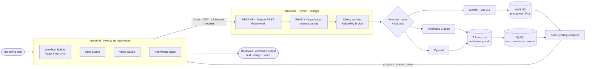
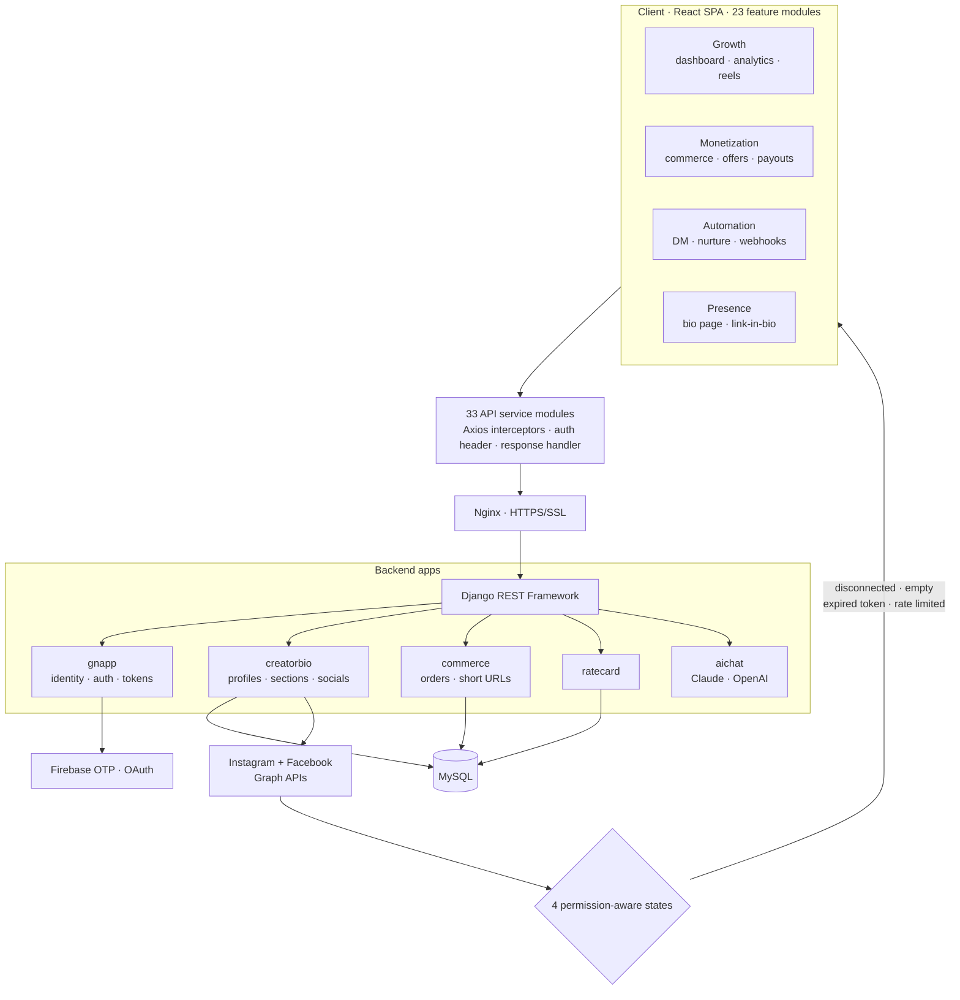
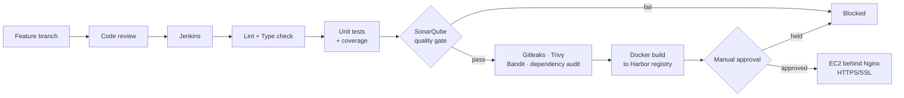

<div align="center">


### Full-Stack Software Engineer · Noida, India

**I ship production software.** 1.5+ years, **5 live products**, **~275K lines** of production code authored,
and **580+ commits** across multi-tenant SaaS platforms in Generative AI, music tech, and the creator economy.

<p>
  <a href="https://pooja-tanwar-fullstack-portfolio.netlify.app/"></a>
  <a href="https://linkedin.com/in/pooja-tanwar-00368a286"></a>
  <a href="mailto:tanwarpooja2410@gmail.com"></a>
  <a href="https://github.com/Pooja24100?tab=repositories"></a>
</p>


<sub>

[Impact](#-impact-at-a-glance) · [Stack](#-technical-stack) · [Production Work](#-production-work) · [Architecture](#-how-i-architect-systems) · [Open Source](#-open-source-projects) · [Experience](#-experience) · [Engineering Practice](#-engineering-practice) · [Contact](#-lets-talk)

</sub>

</div>

---

## 📊 Impact at a Glance

| | |
| :-- | :-- |
| **Experience** | 1.5+ years professional · Associate Software Engineer at The Higher Pitch |
| **Products shipped** | **5 in production** — Blaze/Tingg.ai, GNCreators, GrooveNexus Studio, GNTunes.com, GenAI Job Prep |
| **Code ownership** | **260 of 344 commits (76%)** on Blaze frontend · **329 of 518 commits (63%)** on GNCreators frontend |
| **Scale delivered** | ~100K LOC · 339 modules (Blaze) · ~177K LOC · 766 modules (GNCreators) |
| **Test discipline** | 55 Jest suites (Blaze) · 237 test files (GNCreators) · coverage enforced in CI |
| **Measured results** | **~20% faster** app performance · **~15% less** repeated dev effort via 20+ reusable components |
| **AI in production** | Multi-step Claude / OpenAI / Gemini pipelines for **text, image and video** |
| **Security shipped** | JWT · Firebase OTP · RBAC · OAuth · HTTPS/SSL behind Nginx |

<sub>Commit and LOC figures are measured directly from the private company repositories I work in daily.</sub>

---

## 🛠 Technical Stack

<table>
<tr><td><b>Languages</b></td><td>


</td></tr>
<tr><td><b>Frontend</b></td><td>


<sub>App Router · SSR / ISR / SSG · React Hooks · Context API · Zod + React Hook Form · Recharts · D3 · Responsive Web Design</sub>

</td></tr>
<tr><td><b>Backend & APIs</b></td><td>


<sub>REST API design · JWT + Knox auth · Role-Based Access Control · OAuth (Google / Firebase) · MVC · RabbitMQ · async job orchestration</sub>

</td></tr>
<tr><td><b>Data & AI</b></td><td>


<sub>Data modeling · Firestore security rules · LLM applications · prompt engineering · multi-step AI workflows · token + cost auditing · RAG-style knowledge retrieval</sub>

</td></tr>
<tr><td><b>Cloud & DevSecOps</b></td><td>


<sub>HTTPS/SSL · Harbor registry · Trivy · Gitleaks · Bandit · dependency auditing · quality gates · React Testing Library · code review</sub>

</td></tr>
</table>

---

## 🚀 Production Work

> These are live, revenue-facing products built at **The Higher Pitch**. Source is private — the engineering detail, scale figures and architecture below are what I personally designed, built and shipped.

### 1. Blaze / Tingg.ai — Multi-Tenant AI Content & Marketing Platform

<p>


</p>

A multi-tenant SaaS platform where a marketing team composes an AI content **workflow as a DAG** — a graph of LLM and image-generation nodes — runs it against a brief, and gets auditable text, image and video output back.

**What I built**

- **Visual workflow builder** on React Flow with four synchronized views — canvas, build, run and table — including node editing, drag-connect DAG authoring, selective re-execution and per-node refinement chat.
- **Video generation pipeline UI**: idea to script to storyboard scenes to images to stitched clips, with ZIP/asset export routes and shot-level controls.
- **Async AI orchestration on the client**: polling-based status handling for long-running generations, with cancellation, progress tracking, optimistic states and failure recovery so a 4-minute Veo render never blocks or lies to the user.
- **Chat Studio** — a conversational surface for composing and versioning workflow output before it is committed.
- **Knowledge Base (OCI)** — document ingestion UI with an ingestion poller hook, chunk retrieval and brand-guardrail surfacing.
- **Marketing suite**: campaigns, plans, marketing calendar, creative assets, competitor tracking.
- **Creative library**: characters, locations and professional presets reused across video scripts.
- **Multi-tenancy front to back**: organization switcher, workspaces, invite flow with token expiry, workspace members, `useOrgRole` / `useIsWorkspaceMember` permission hooks, super-admin org management, impersonation snapshots.
- **Billing & credits** UI wired to per-model provider pricing and token-usage auditing.

**Engineering detail** — 339 source modules · **18 dedicated API service layers** · **15 Redux Toolkit slices** · 55 Jest + RTL suites · TypeScript strict checks in CI · custom MUI 7 + Tailwind + Radix design system · **13-stage Jenkins pipeline** ending in a Dockerized deploy to EC2 behind Nginx with HTTPS/SSL.

`Next.js 16 (App Router)` `React 18` `TypeScript` `Redux Toolkit` `React Flow` `Material UI 7` `Tailwind` `Zod` `Recharts` `Django + DRF` `Celery + RabbitMQ` `MySQL` `AWS S3` `Claude` `OpenAI` `Gemini + Veo 3.1` `Docker` `Nginx` `Jenkins` `SonarQube`

---

### 2. GNCreators — Creator Growth & Automation Platform

<p>


</p>

An end-to-end platform for creators to grow, monetize and automate their audience — spanning Instagram insights, DM automation, commerce, offers and payouts.

**What I built — 23 feature modules**

| Cluster | Modules |
| :-- | :-- |
| Growth | Dashboard, Analytics, Instagram Insights, Reels, Influencers |
| Monetization | Commerce, Offer Management, New Offer, Rate Card, Payouts, Gigs, Courses |
| Automation | DM Automation, Nurture sequences, Webhooks, AI Chat, Lead Capture |
| Presence | Bio Page, Link-in-Bio, Profile, Lead Magnets, Giveaways |
| Platform | Billing, Help Center, Admin & auth surfaces |

**Engineering detail**

- **766 source modules** across a **33-module API service layer** with Axios interceptors, a centralized response handler and auth-header injection.
- **Meta Graph API integration** (Instagram + Facebook) with four explicit permission-aware states — *disconnected account, empty data, expired token, rate-limited* — so the UI degrades honestly instead of silently failing.
- **Drag-and-drop everywhere**: `react-dnd` + `react-beautiful-dnd` with an HTML5 *and* touch backend, so reordering works on mobile.
- **Auth stack**: Firebase OTP, email verification, claim-profile, password reset, expired-link handling, plus Firestore security rules.
- **237 test files**, coverage published to SonarQube from the exact commit under scan.
- Shipped through a **Jenkins shared-library pipeline** to a **Harbor** registry, deployed as a Docker container behind Nginx on EC2.

`React` `Redux + Thunk` `Material UI 5` `React Router` `Firebase` `D3` `react-dnd` `Axios` `Django REST Framework` `MySQL` `Meta Graph APIs` `Docker` `Nginx` `Harbor` `Jenkins`

**Backend contributions** (Django + DRF, 7 apps, ~152K LOC, 259 pytest suites): rate-card APIs, commerce and affiliate flows, Instagram webhook handling, URL shortener, `creatorbio` app wiring and migration conflict resolution across a 23-stage pipeline gated by SonarQube, Gitleaks, Trivy, Bandit and manual migration approval.

---

### 3. GrooveNexus Studio — Music Release & Royalty Platform

<p></p>

Engineered a **6-step music release workflow**: drag-to-order track sequencing, store-compliance validation before distribution, **Razorpay** payment integration, and royalty reporting sliced across **4 dimensions — song, store, country and month**.

`React` `Node.js` `Express` `REST APIs` `Razorpay`

---

### 4. GNTunes.com — Music Technology Platform

<p></p>

Delivered full-stack features across responsive user-facing interfaces and backend REST API integration on a live consumer music platform.

`React` `Next.js` `Node.js` `REST APIs`

---

## 🧭 How I Architect Systems

Diagrams below describe systems I build and work in daily.

### Blaze / Tingg.ai — AI workflow execution path



### GNCreators — full-stack request flow



### My delivery pipeline — nothing reaches production unreviewed



---

## 💡 Open Source Projects

| Project | What it does | Stack |
| :-- | :-- | :-- |
| **[GenAI Job Preparation Platform](https://github.com/Pooja24100/Gen-AI-Job-Preparation-App)** | Full-stack AI career platform. React frontend on Node/Express REST APIs with MongoDB, JWT auth and role-based access control. Gemini AI runs **server-side only** for interview generation, resume analysis and skill-gap detection — API credentials and prompts never reach the browser. | React · Node.js · Express · MongoDB · Gemini · JWT |
| **[Nova Voice Assistant](https://github.com/Pooja24100/nova-voice-assistant)** | Browser-based Python voice assistant: speech recognition, spoken AI replies, responsive UI and persistent local history. | Python · Flask · JavaScript · SQLite |
| **[Star Wars Character App](https://github.com/Pooja24100/Star-Wars-Character-App)** | Responsive SWAPI client with pagination, search, filters, detail modal and fully handled loading / empty / error states. | React · Vite · Tailwind |

---

## 💼 Experience

```
2025 ──●  Associate Software Engineer · The Higher Pitch · Noida        Sep 2025 – Present
        │  Full-stack delivery across 4 production products. Multi-step Generative AI
        │  workflows (OpenAI + Claude) for text, image and video. 4 security controls:
        │  JWT, Firebase OTP, RBAC, OAuth. GrooveNexus Studio 6-step release workflow
        │  with Razorpay payments and 4-dimension royalty reporting.
        │
2025 ──●  Software Engineer Training · The Higher Pitch · Noida         Mar 2025 – Sep 2025
        │  Built 20+ reusable React components (forms, tables, modals, data cards,
        │  dashboards) → ~15% less repeated dev effort. Lifted app performance ~20%
        │  via memoization, component optimization and refactoring. Standardized
        │  4 interface states across the codebase: loading, validation, empty, error.
        │
2024 ──●  Web Developer Intern · Promotech Advertising · Jaipur         Jun 2024 – Jul 2024
        │  Delivered and debugged 10+ responsive pages with HTML5, CSS3, Bootstrap
        │  and JavaScript. REST API integration, cross-browser and mobile fixes.
        │
2021 ──●  B.Tech, Computer Science & Engineering                             2021 – 2025
           The Technological Institute of Textiles & Sciences (MDU Rohtak) · 83.01%
```

**Certifications** — React JS *(Simplilearn)* · Full Stack Java Development *(Ducat)* · Introduction to Java & OOP *(Udemy)*

---

## 🔬 Engineering Practice

| Discipline | What that means in my codebases |
| :-- | :-- |
| **Honest UI states** | Every async surface handles loading, validation, empty and error explicitly. I standardized these four states as a convention across two products rather than leaving each screen to improvise. |
| **Service-layer discipline** | API calls never live in components. 18 service modules on Blaze, 33 on GNCreators — centralized interceptors, auth headers and one response handler, so auth refresh or a base-URL change is a one-file edit. |
| **Secrets stay server-side** | LLM keys and prompts are proxied through the backend. Gitleaks runs on every build; `.gitleaks.toml` and `.trivyignore` are maintained with written justifications, not blanket ignores. |
| **Tests as a gate, not decoration** | 55 Jest suites on Blaze, 237 test files on GNCreators, 259 pytest suites on the backend — coverage published to SonarQube from the exact commit being scanned, with the pipeline failing on a missed gate. |
| **Dependency hygiene** | I resolve CVEs with targeted `overrides` and document *why* each one is safe — including the ones I deliberately do **not** override because the patched release breaks a transitive consumer. |
| **Async honesty** | Long-running AI jobs get polling, progress, cancellation and retry. A user always knows whether their 4-minute video render is working, queued or dead. |
| **Multi-tenancy first** | Organization is the hard boundary. Permission hooks and RBAC guards are wired at the route and component level, not bolted on later. |
| **Documentation that ships** | Living architecture docs, per-feature API guides and ADRs — tagged live / stubbed / planned so a new joiner knows what is real. |

---

## 📈 GitHub Activity

<div align="center">


<br /><br />


<br />

<sub>Public activity reflects personal projects only. The majority of my output — 580+ commits across three private company repositories — is not visible here.</sub>

</div>

---

## 🎯 Currently Focused On

- **Deepening TypeScript** — migrating JS surfaces to strict types and pushing type-check into every gate
- **AI workflow reliability** — retries, queue backpressure, cost and latency budgets for LLM pipelines
- **System design at multi-tenant scale** — tenant isolation, caching strategy, audit trails
- **Raising coverage** toward meaningful thresholds rather than vanity percentages
- **CI/CD ownership** — extending pipelines I already maintain with better gates and faster feedback

---

## 📬 Let's Talk

<div align="center">

**Open to Software Engineer / Full-Stack Developer roles.**

I am most useful on teams shipping real products where React/Next.js frontends,
Python or Node backends and AI features all have to work together in production.

<p>
  <a href="https://pooja-tanwar-fullstack-portfolio.netlify.app/"></a>
  <a href="https://linkedin.com/in/pooja-tanwar-00368a286"></a>
</p>
<p>
  <a href="mailto:tanwarpooja2410@gmail.com"></a>
  <a href="https://github.com/Pooja24100"></a>
</p>

📍 Noida, India · Open to relocation and remote

<br />


</div>
