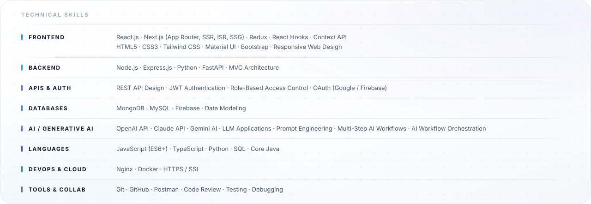
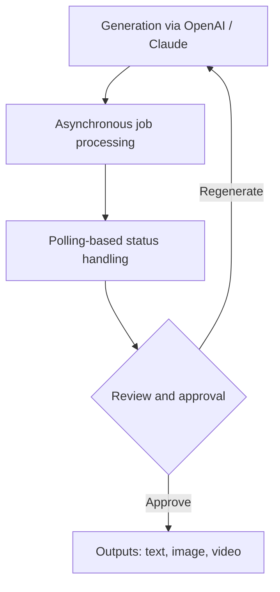

<picture>
  <source media="(prefers-color-scheme: dark)" srcset="assests/hero-dark.svg" />
  <source media="(prefers-color-scheme: light)" srcset="assests/hero-light.svg" />
  
</picture>

  &nbsp;
  &nbsp;
  &nbsp;
  

## About

> **I build production web applications, and the multi-step AI workflows that run behind them.**

Full-Stack Software Engineer in Noida, India, with more than **1.5 years of experience** and **5 production products** delivered across Generative AI, music technology and the creator economy. I build responsive applications, backend services and REST APIs with React.js, Next.js, JavaScript, TypeScript, Node.js, Express.js, Python and MongoDB, and I use OpenAI, Claude and Gemini to compose secure multi-step AI workflows for text, image and video generation.

Across that work I improved application performance by approximately `20%` and reduced repeated development effort by approximately `15%`. Alongside the engineering: problem solving, clear communication and teamwork.

## What I build with

Everything I work with, grouped the way I actually reach for it.

<picture>
  <source media="(prefers-color-scheme: dark)" srcset="assests/stack-dark.svg" />
  <source media="(prefers-color-scheme: light)" srcset="assests/stack-light.svg" />
  
</picture>

## Featured Projects

<picture>
  <source media="(prefers-color-scheme: dark)" srcset="assests/projects-dark.svg" />
  <source media="(prefers-color-scheme: light)" srcset="assests/projects-light.svg" />
  
</picture>

### Blaze Tingg

**AI Content and Marketing Automation Platform** — editable multi-step AI pipelines, wrapped in campaign execution, creative asset, marketing calendar and web data interfaces.

<b>Next.js</b> · <b>Python</b> · <b>OpenAI</b> · <b>Claude</b> · <b>Material UI</b> · <b>REST APIs</b> · <b>Nginx</b> &nbsp;·&nbsp; Production, source not public

- Production AI workflows with **OpenAI** and **Claude** for three content types — text, image and video — built as editable multi-step pipelines with review, approval, regeneration and asynchronous processing.
- Campaign execution, creative asset, marketing calendar and web data interfaces, with Python backend workflows deployed behind Nginx with HTTPS/SSL.

> **Key contribution** — polling-based status handling for long-running AI generation workflows.

How a single generation run moves through the platform:

### [GenAI Job Preparation Platform](https://github.com/Pooja24100/Gen-AI-Job-Preparation-App)

**Full-stack job preparation platform** — built solo and open source, with every model call kept on the server.

<b>React.js</b> · <b>Node.js</b> · <b>Express.js</b> · <b>MongoDB</b> · <b>Gemini AI</b> · <b>JWT</b> &nbsp;·&nbsp; Solo, open source &nbsp;·&nbsp; <a href="https://github.com/Pooja24100/Gen-AI-Job-Preparation-App">View repository</a>

- React.js frontend with Node.js and Express.js REST APIs over MongoDB, secured with JWT authentication and role-based access control.
- **Gemini AI** integrated server-side for three features: interview question generation, resume analysis and skill-gap detection.

> **Key contribution** — protected the AI API credentials and prompts by keeping the model integration entirely server-side.

### GNCreators

**Creator Growth and Automation Platform** — eight responsive modules across creator profiles, Instagram insights, campaigns and automation.

<b>React.js</b> · <b>JavaScript</b> · <b>Material UI</b> · <b>Meta APIs</b> · <b>REST APIs</b> &nbsp;·&nbsp; Production, source not public

- Eight responsive creator-growth modules: profiles, Instagram insights, campaigns, DM automation, lead magnets, giveaways, Link-in-Bio and media performance.
- Connected Instagram, Facebook and REST APIs with four permission-aware states.

> **Key contribution** — the four permission-aware states: disconnected account, empty data, expired token and rate-limited response.

**Also on GitHub** &nbsp; [`nova-voice-assistant`](https://github.com/Pooja24100/nova-voice-assistant) &nbsp; [`Star-Wars-Character-App`](https://github.com/Pooja24100/Star-Wars-Character-App) &nbsp; [`all repositories`](https://github.com/Pooja24100?tab=repositories)

## Experience

**Associate Software Engineer** &nbsp;·&nbsp; The Higher Pitch &nbsp;·&nbsp; Sep 2025 - Present · Noida, India

Full-stack delivery across four production products, including Generative AI workflows and platform security controls.

`4 production products` `3 AI content types` `4 security controls` `6-step release workflow`

- Delivered full-stack features across four production products: **Blaze Tingg**, **GNTunes.com**, **GrooveNexus Studio** and **GNCreators**.
- Built multi-step Generative AI workflows with OpenAI and Claude for three content types — text, image and video — covering review, editing, regeneration, progress tracking and asynchronous status.
- Implemented four security controls: JWT authentication, Firebase OTP, role-based access control and OAuth.
- Engineered the GrooveNexus Studio six-step music release workflow: drag-to-order tracks, store-compliance validation, Razorpay payments and royalty reporting across four dimensions (song, store, country, month).
- Supported production releases through team ceremonies, code reviews, testing, debugging, deployment and issue resolution across the four products.

React.js · Next.js · Redux · Node.js · Python · REST APIs

**Software Engineer Training** &nbsp;·&nbsp; The Higher Pitch &nbsp;·&nbsp; Mar 2025 - Sep 2025 · Noida, India

Frontend and full-stack development, focused on a reusable component layer and on making existing screens faster.

`20+ reusable components` `~20% performance` `~15% less repeated effort`

- Developed 20+ reusable React.js components across forms, tables, modals, data cards and dashboards, reducing repeated development effort by approximately 15%.
- Improved application performance by approximately 20% through memoization, component optimization and refactoring, and standardized loading, validation, empty and error states.
- Connected React.js applications to REST APIs and standardized **4 interface states**.

React.js · REST APIs

<b>Earlier experience</b>

 

**Web Developer Intern** &nbsp;·&nbsp; Promotech Advertising &nbsp;·&nbsp; Jun 2024 - Jul 2024 · Jaipur, India

Front-end development.

`10+ responsive pages` `cross-browser fixes`

- Delivered 10+ responsive pages, integrating REST APIs and resolving cross-browser and mobile compatibility issues.
- Debugged and optimized 10+ responsive pages to improve cross-browser compatibility, mobile usability and frontend reliability.

HTML5 · CSS3 · Bootstrap · JavaScript · REST APIs

## On GitHub

  <picture>
    <source media="(prefers-color-scheme: dark)" srcset="https://streak-stats.demolab.com?user=Pooja24100&amp;background=0D1117&amp;border=1E293B&amp;stroke=1E293B&amp;ring=6366F1&amp;fire=6366F1&amp;currStreakNum=F1F5F9&amp;sideNums=CBD5E1&amp;currStreakLabel=6366F1&amp;sideLabels=94A3B8&amp;dates=64748B&amp;hide_border=false" />
    <source media="(prefers-color-scheme: light)" srcset="https://streak-stats.demolab.com?user=Pooja24100&amp;background=FFFFFF&amp;border=E2E8F0&amp;stroke=E2E8F0&amp;ring=4F46E5&amp;fire=4F46E5&amp;currStreakNum=0F172A&amp;sideNums=475569&amp;currStreakLabel=4F46E5&amp;sideLabels=64748B&amp;dates=94A3B8&amp;hide_border=false" />
    
  </picture>

<picture>
  <source media="(prefers-color-scheme: dark)" srcset="https://raw.githubusercontent.com/Pooja24100/Pooja24100/output/github-snake-dark.svg" />
  <source media="(prefers-color-scheme: light)" srcset="https://raw.githubusercontent.com/Pooja24100/Pooja24100/output/github-snake.svg" />
  
</picture>

## Education and Certifications

**B.Tech, Computer Science and Engineering** &nbsp;·&nbsp; The Technological Institute of Textiles and Sciences (MDU Rohtak) &nbsp;·&nbsp; 2021 - 2025 · Aggregate 83.01%

**Certifications** &nbsp;·&nbsp; React JS (Simplilearn) · Full Stack Java Development (Ducat) · Introduction to Java and OOP (Udemy)

<b>Get in touch</b>

  &nbsp;
  &nbsp;
  &nbsp;
  

  Noida, India &nbsp;·&nbsp; <a href="https://pooja-tanwar-fullstack-portfolio.netlify.app/">pooja-tanwar-fullstack-portfolio.netlify.app</a> &nbsp;·&nbsp; <a href="mailto:tanwarpooja2410@gmail.com">tanwarpooja2410@gmail.com</a>

