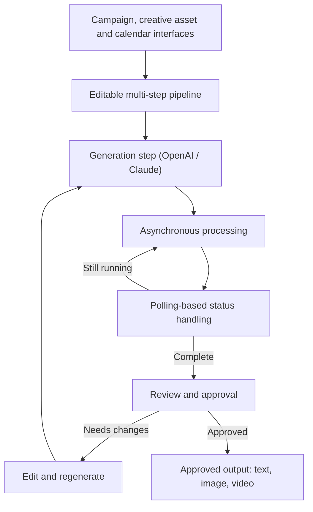

<!-- ====================================================================== -->
<!-- ==  HERO  ============================================================ -->
<!-- ====================================================================== -->

&emsp;
&emsp;
&emsp;

<!-- ====================================================================== -->
<!-- ==  ABOUT  =========================================================== -->
<!-- ====================================================================== -->

<h2>👩‍💻 &nbsp;About Me</h2>

 

Full-Stack Software Engineer with more than **1.5 years of experience** and **5 production products** delivered across **Generative AI**, **music technology** and the **creator economy**.

- 🧩 &nbsp;I build responsive applications, backend services and REST APIs with **React.js**, **Next.js**, **JavaScript**, **TypeScript**, **Node.js**, **Express.js**, **Python** and **MongoDB**.
- 🤖 &nbsp;I work with **OpenAI**, **Claude** and **Gemini** to build secure multi-step AI workflows for **text, image and video generation**.
- ⚡ &nbsp;Improved application performance by **~20%** and reduced repeated development effort by **~15%**.
- 📍 &nbsp;Based in **Noida, India** — problem solving, clear communication and teamwork.

<!-- ====================================================================== -->
<!-- ==  TECH STACK  ====================================================== -->
<!-- ====================================================================== -->

<h2>🛠️ &nbsp;Tech Stack</h2>

 

 

 

**Languages** &nbsp;·&nbsp; `JavaScript (ES6+)` `TypeScript` `Python` `SQL` `Core Java`

**Frontend** &nbsp;·&nbsp; `React.js` `Next.js (App Router, SSR, ISR, SSG)` `Redux` `React Hooks` `Context API` `HTML5` `CSS3` `Tailwind CSS` `Material UI` `Bootstrap` `Responsive Web Design`

**Backend and APIs** &nbsp;·&nbsp; `Node.js` `Express.js` `Python` `FastAPI` `REST API Design` `JWT Authentication` `Role-Based Access Control` `OAuth (Google/Firebase)` `MVC Architecture`

**Databases and AI** &nbsp;·&nbsp; `MongoDB` `MySQL` `Firebase` `Data Modeling` `OpenAI API` `Claude API` `Gemini AI` `LLM Applications` `Prompt Engineering` `Multi-Step AI Workflows` `AI Workflow Orchestration`

**Cloud, DevOps and Engineering** &nbsp;·&nbsp; `Nginx` `Docker` `HTTPS/SSL` `Git` `GitHub` `Postman` `Code Review` `Testing` `Debugging`

<!-- ====================================================================== -->
<!-- ==  EXPERIENCE  ====================================================== -->
<!-- ====================================================================== -->

<h2>💼 &nbsp;Experience</h2>

 

### Associate Software Engineer &nbsp;·&nbsp; The Higher Pitch

**Sep 2025 – Present** &nbsp;·&nbsp; Noida, India

- Delivered full-stack features across **4 production products** — Blaze Tingg, GNTunes.com, GrooveNexus Studio and GNCreators — using React.js, Next.js, Redux, Node.js, Python and REST APIs.
- Built multi-step Generative AI workflows with **OpenAI** and **Claude** for 3 content types (text, image, video), including review, editing, regeneration, progress tracking and asynchronous status handling.
- Implemented **4 security controls**: JWT authentication, Firebase OTP, role-based access control and OAuth.
- Engineered the GrooveNexus Studio **6-step music release workflow**: drag-to-order tracks, store-compliance validation, Razorpay payments and royalty reporting across 4 dimensions (song, store, country, month).
- Supported production releases through team ceremonies, code reviews, testing, debugging, deployment activities and issue resolution across 4 products.

### Software Engineer Training &nbsp;·&nbsp; The Higher Pitch

**Mar 2025 – Sep 2025** &nbsp;·&nbsp; Noida, India &nbsp;·&nbsp; Frontend / Full-Stack Development

- Developed **20+ reusable React.js components** across forms, tables, modals, data cards and dashboards, reducing repeated development effort by approximately **15%**.
- Improved application performance by approximately **20%** through memoization, component optimization and refactoring; standardized loading, validation, empty and error states.
- Connected React.js applications to REST APIs and standardized 4 interface states.

### Web Developer Intern &nbsp;·&nbsp; Promotech Advertising

**Jun 2024 – Jul 2024** &nbsp;·&nbsp; Jaipur, India &nbsp;·&nbsp; Front-End Development

- Delivered **10+ responsive pages** using HTML5, CSS3, Bootstrap and JavaScript, integrating REST APIs and resolving cross-browser and mobile compatibility issues.
- Debugged and optimized 10+ responsive pages to improve cross-browser compatibility, mobile usability and frontend reliability.

<!-- ====================================================================== -->
<!-- ==  PROJECTS  ======================================================== -->
<!-- ====================================================================== -->

<h2>🚀 &nbsp;Selected Projects</h2>

 

### 🔥 &nbsp;Blaze Tingg &nbsp;·&nbsp; AI Content &amp; Marketing Automation Platform

`OpenAI` `Claude` `REST APIs` `HTTPS/SSL` &nbsp;·&nbsp; **Production**

- Production AI workflows with OpenAI and Claude for 3 content types (text, image, video) — editable multi-step pipelines with review, approval, regeneration and asynchronous processing.
- Campaign execution, creative asset, marketing calendar and web data interfaces; Python backend workflows deployed behind Nginx with HTTPS/SSL.
- Connected the frontend to REST APIs with polling-based status handling for long-running AI generation.

### 🎯 &nbsp;[GenAI Job Preparation Platform](https://github.com/Pooja24100/Gen-AI-Job-Preparation-App) &nbsp;·&nbsp; Full-Stack

`Gemini AI` `JWT` `Role-Based Access Control` &nbsp;·&nbsp; **Solo · Open Source**

- React.js frontend with Node.js/Express REST APIs and MongoDB, JWT authentication and role-based access control; Gemini AI on the server powers 3 features — interview generation, resume analysis and skill-gap detection.
- Protected AI API credentials and prompts through server-side integration and backend-controlled access.

### 📈 &nbsp;GNCreators &nbsp;·&nbsp; Creator Growth &amp; Automation Platform

`Meta APIs` `REST APIs` &nbsp;·&nbsp; **Production**

- 8 responsive creator-growth modules built with React.js and Material UI: profiles, Instagram insights, campaigns, DM automation, lead magnets, giveaways, Link-in-Bio and media performance.
- Connected Instagram, Facebook and REST APIs with 4 permission-aware states — disconnected account, empty data, expired token and rate-limited response.

&emsp;

<!-- ====================================================================== -->
<!-- ==  AI PIPELINE DIAGRAM  ============================================= -->
<!-- ====================================================================== -->

<h2>🧠 &nbsp;How I Build Multi-Step AI Workflows</h2>

 

The editable multi-step Generative AI pipeline behind **Blaze Tingg**.

<!-- ====================================================================== -->
<!-- ==  GITHUB STATS  ==================================================== -->
<!-- ====================================================================== -->

<h2>📊 &nbsp;GitHub Stats</h2>

 

 

<picture>
  <source media="(prefers-color-scheme: dark)" srcset="https://raw.githubusercontent.com/Pooja24100/Pooja24100/output/github-snake-dark.svg" />
  <source media="(prefers-color-scheme: light)" srcset="https://raw.githubusercontent.com/Pooja24100/Pooja24100/output/github-snake.svg" />
  
</picture>

<!-- ====================================================================== -->
<!-- ==  EDUCATION & CERTIFICATIONS  ====================================== -->
<!-- ====================================================================== -->

<h2>🎓 &nbsp;Education &amp; Certifications</h2>

 

**B.Tech in Computer Science and Engineering**

The Technological Institute of Textiles and Sciences (MDU Rohtak) &nbsp;·&nbsp; 2021 – 2025 &nbsp;·&nbsp; Aggregate **83.01%**

 

<!-- ====================================================================== -->
<!-- ==  CONTACT + FOOTER  ================================================ -->
<!-- ====================================================================== -->

### 💬 &nbsp;Get in touch

